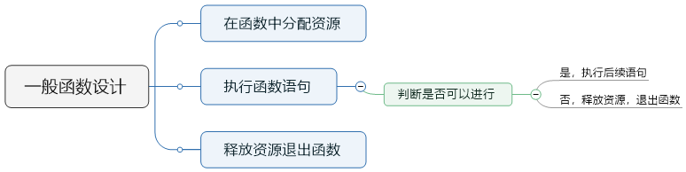

# 数据类型    

## 1. 什么是数据类型？
- 数据类型可以理解为固定内存大小的别名；
- 数据类型是创建变量的模子。
```c
char: 1 byte
short: 2 byte
int: 4 byte
```
## 2. 变量的本质？
- 变量是一段实际连续存储空间的别名；
- 程序中通过变量来申请并命名存储空间；
- 通过变量的名字可以使用存储空间。

## 3. auto，static，register分析
- **auto**是C语言中局部变量的**默认属性**，指明声明的变量在**栈**上分配空间；    
- **static**属性关键字指明变量的**静态**属性，同时具有**作用域限定符**的意义；    
- **static**修饰的局部变量存储在程序静态区，静态的局部变量**只会被初始化一次**；    
- **static**的另一个意义是**文件作用域标识符**：    
  - **static修饰的`全局变量`作用域只是声明的文件中**；   
  - **static修饰的`函数`作用域只是声明的文件中。**   
- **register**关键字指明将变量存储于寄存器中。   
- **register**只是请求存储器变量，但不一定请求成功:   
  - **register**变量必须是CPU寄存器可以接受的值；   
  - 不能用&运算符获取**register**变量的地址。

 ## 4. 分支语句分析 —— if（用于按“片”进行判断的情形中，完全可以取代switch语句）
 **if语句中零值比较的注意点：**    
- **bool**型变量应该直接出现于条件中，不要进行比较 ，0为假，非0为真；
- 普通变量跟常数比较时，常数应该出现在比较符号的左边（双等号漏掉一个时编译器会提示错误）；
- **float**型变量不能直接与0值比较，需要定义精度。   

## 5. 分支语句分析——switch（用于需要对各个离散值进行分别判断情况中，无法完全取代if语句）
- 每个**case**语句分支必须要有**break**，否则会导致分支重叠；   
- **default**语句有必要加上，以处理特殊情况。**switch**语句的限制：   
  - **case**语句中的值只能是整型或字符型；   
  - **case**语句排列顺序分析：   
  - 按字母或数字顺序排列各条语句；   
  - 正常情况放在前面，异常情况放在后面；   
  - **default**语句只用处处理真正的默认情况。   

 ## 6. 循环语句分析——do，while，for的区别
- do语句先执行后判断，循环体至少执行一次；   
- while语句先判断后执行，循环体可能不执行；   
- for语句先判断后执行，相比while更简洁。   
- break和continue的区别：   
  - break表示终止语句块的执行；   
  - continue表示终止本次循环，进入下次循环执行。   


```c
do
{

}
while(0);
//统一释放资源 
```