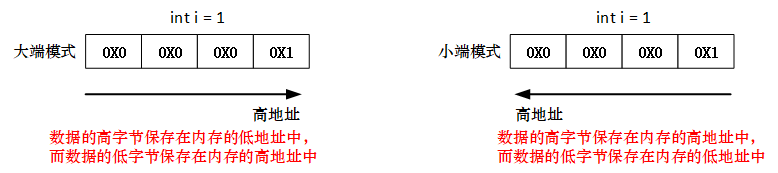

# struct和union分析

## 由结构体产生柔性数组
- 柔性数组即数组大小待定的数组；
- C语言中结构体的最后一个元素可以是大小未知的数组；
- C语言中可以由结构体产生柔性数组。

```c
#include<stdio.h>
#include<malloc.h>

typedef struct   _soft_array
{
    int len;
    int array[];
}SoftArray;

int main(int argc, char const *argv[])
{
    int i = 0;
    SoftArray* sa = (SoftArray*)malloc(sizeof(SoftArray)+sizeof(int)*10);
    sa->len = 10;
    for (int i = 0; i < sa->len; i++)
         sa->array[i] = i + 1;

    for (int i = 0; i < sa->len; ++i)
          printf("%d\n", sa->array[i]);
    free(sa);
    return 0;
}
```

## union和struct的区别
- struct中的每个域在内存中都独立分配空间；
- union只分配最大域的空间，所有域共享这个空间。
```c
struct A
{
    int a;
    int b;
    int c;
};

union B
{
    int a;
    int b;
    int c;
};

int main()
{   
    printf("%lu\n", sizeof(struct A));   // 12
    printf("%lu\n", sizeof(union B));   // 4
}
```

## union使用的注意事项   
- union的使用受系统大小端的影响   
   

```c
#include<stdio.h>
#include<malloc.h>
int checkSys()
{
    union check
    {
        int i;
        char c;
    } cc;
    cc.i = 1;
    return 1 == cc.c;
}
int main(int argc, char const *argv[])
{
    printf("%d\n", checkSys());  // 若输出1，则为小端模式；若输出0，则为大端模式
    return 0;
}
```
