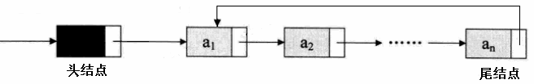
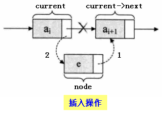
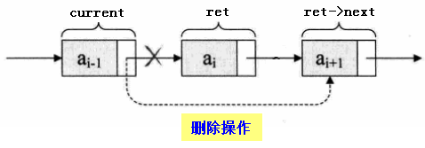
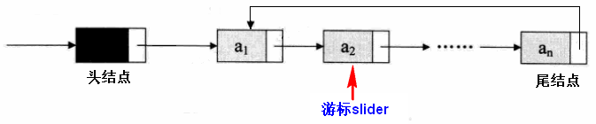
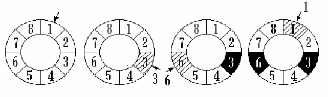
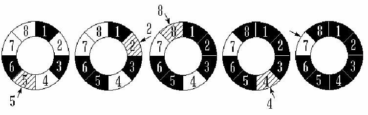

# 循环链表  
## 1、单链表的局限   
- 单链表可以用于表示任意的线性关系
- 有些线性关系是循环的，即没有队尾元素

## 2、单链表的改进   
- 循环链表的定义

将单链表中最后一个数据元素的next指针指向第一个元素    
    

## 3、循环链表的操作   
- 循环链表拥有单链表的所有操作
  - 创建链表
  - 销毁链表
  - 获取链表长度
  - 清空链表
  - 获取第pos个元素操作
  - 插入元素到位置pos
  - 删除位置pos处的元素    
    
    

## 4、将单链表改写成循环链表   
```c
typedef void CircleList;
typedef struct _tag_CircleListNode CircleListNode;
struct _tag_CircleListNode
{
    CircleListNode* next;
};


typedef struct _tag_CircleList
{
    CircleListNode header;
    CircleListNode* slider;
    int length;
} TCircleList;


CircleList* CircleList_Create() // O(1)
{
    TCircleList* ret = (TCircleList*)malloc(sizeof(TCircleList));
    
    if( ret != NULL )
    {
        ret->length = 0;
        ret->header.next = NULL;
        ret->slider = NULL;
    }
    
    return ret;
}


void CircleList_Destroy(CircleList* list) // O(1)
{
    free(list);
}


void CircleList_Clear(CircleList* list) // O(1)
{
    TCircleList* sList = (TCircleList*)list;
    
    if( sList != NULL )
    {
        sList->length = 0;
        sList->header.next = NULL;
        sList->slider = NULL;
    }
}


int CircleList_Length(CircleList* list) // O(1)
{
    TCircleList* sList = (TCircleList*)list;
    int ret = -1;
    
    if( sList != NULL )
    {
        ret = sList->length;
    }
    
    return ret;
}


int CircleList_Insert(CircleList* list, CircleListNode* node, int pos) // O(n)
{
    TCircleList* sList = (TCircleList*)list;
    int ret = (sList != NULL) && (pos >= 0) && (node != NULL);
    int i = 0;
    
    if( ret )
    {
        CircleListNode* current = (CircleListNode*)sList;
        
        for(i=0; (i<pos) && (current->next != NULL); i++)
        {
            current = current->next;
        }
        
        node->next = current->next;
        current->next = node;
        
        if( sList->length == 0 )
        {
            sList->slider = node;
            node->next = node; // 插入第一个元素时，next指针需要指向自己
        }
        
        sList->length++;
    }
    
    return ret;
}


CircleListNode* CircleList_Get(CircleList* list, int pos) // O(n)
{
    TCircleList* sList = (TCircleList*)list;
    CircleListNode* ret = NULL;
    int i = 0;
    
    if( (sList != NULL) && (pos >= 0) )
    {
        CircleListNode* current = (CircleListNode*)sList;
        
        for(i=0; i<pos; i++)
        {
            current = current->next;
        }
        
        ret = current->next;
    }
    
    return ret;
}


CircleListNode* CircleList_Delete(CircleList* list, int pos) // O(n)
{
    TCircleList* sList = (TCircleList*)list;
    CircleListNode* ret = NULL;
    int i = 0;
    
    if( (sList != NULL) && (pos >= 0) )
    {
        CircleListNode* current = (CircleListNode*)sList;
        CircleListNode* first = sList->header.next;
        CircleListNode* last = (CircleListNode*)CircleList_Get(sList, sList->length - 1);
        
        for(i=0; i<pos; i++)
        {
            current = current->next;
        }
        
        ret = current->next;
        current->next = ret->next;
        
        sList->length--;
        
        if( first == ret )
        {
            sList->header.next = ret->next;
            last->next = ret->next;
        }
        
        if( sList->slider == ret )
        {
            sList->slider = ret->next;
        }
        
        if( sList->length == 0 )
        {
            sList->header.next = NULL;
            sList->slider = NULL;
        }
    }
    
    return ret;
}
```

## 5、循环链表的操作
- 游标的定义    
在循环链表中可以定义一个“当前”指针，这个指针通常称为游标，可以通过这个游标来遍历链表中的所有元素。    
    

## 6、循环链表的操作
- 循环链表的新操作
  - 获取当前游标指向的数据元素
  - 将游标重置指向链表中的第一个数据元素
  - 将游标移动指向到链表中的下一个数据元素
  - 直接指定删除链表中的某个数据元素   
```c
CircleListNode* CircleList_DeleteNode(CircleList* list,  CircleListNode* node);
CircleListNode* CircleList_Reset(CircleList* list);
CircleListNode* CircleList_Current(CircleList* list);
CircleListNode* CircleList_Next(CircleList* list);
```

## 7、添加循环链表的新操作
```c
CircleListNode* CircleList_DeleteNode(CircleList* list, CircleListNode* node) // O(n)
{
    TCircleList* sList = (TCircleList*)list;
    CircleListNode* ret = NULL;
    int i = 0;
    
    if( sList != NULL )
    {
        CircleListNode* current = (CircleListNode*)sList;
        
        // 查找node在list中的逻辑位置
        for(i=0; i<sList->length; i++)
        {
            if( current->next == node )
            {
                ret = current->next;
                break;
            }
            
            current = current->next;
        }
        
        if( ret != NULL )
        {
            CircleList_Delete(sList, i);
        }
    }
    
    return ret;
}


CircleListNode* CircleList_Reset(CircleList* list) // O(1)
{
    TCircleList* sList = (TCircleList*)list;
    CircleListNode* ret = NULL;
    
    if( sList != NULL )
    {
        sList->slider = sList->header.next;
        ret = sList->slider;
    }
    
    return ret;
}


CircleListNode* CircleList_Current(CircleList* list) // O(1)
{
    TCircleList* sList = (TCircleList*)list;
    CircleListNode* ret = NULL;
    
    if( sList != NULL )
    {
        ret = sList->slider;
    }
    
    return ret;
}


CircleListNode* CircleList_Next(CircleList* list) // O(1)
{
    TCircleList* sList = (TCircleList*)list;
    CircleListNode* ret = NULL;
    
    if( (sList != NULL) && (sList->slider != NULL) )
    {
        ret = sList->slider;
        sList->slider = ret->next;
    }
    
    return ret;
}
```


## 8、循环链表的应用约瑟夫问题
n 个人围成一个圆圈，首先第 1 个人从 1 开始一个人一个人顺时针报数，报到第 m  个人，令其出列。然后再从下一 个人开始从  1 顺时针报数，报到第 m 个人，再令其出列，…，如此下去，求出列顺序。    
    
    

## 9、小结
- 循环链表只是在单链表的基础上做了一个加强
- 循环链表可以完全取代单链表的使用
- 循环链表的Next和Current操作可以高效的遍历链表中的所有元素


