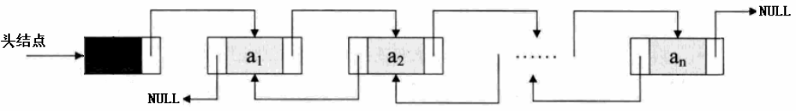
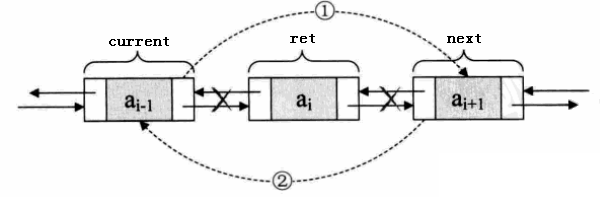

# 双向链表

## 1、单链表的局限
- 单链表的结点都只有一个指向下一个结点的指针
- 单链表的数据元素无法直接访问其前驱元素

**逆序访问单链表中的元素是极其耗时的操作！！！**   
```c
len = LinkList_Length(list);
for(i=len-1; len>=0; i--)
{
    LinkListNode* p = LinkList_Get(list, i);
    // 访问数据p中的元素
    // ...
}
```

## 2、双向链表的定义   
**在单链表的结点中增加一个指向其前驱的pre指针**     

   

## 3、双向链表的操作
- 双向链表拥有单链表的所有操作
  - 创建链表
  - 销毁链表
  - 获取链表长度
  - 清空链表
  - 获取第pos个元素操作
  - 插入元素到位置pos
  - 删除位置pos处的元素
- 双向链表的插入操作   
   
```c
current->next = node;
node->next = next;
next->pre = node;
node->pre = current;
```
- 双向链表的删除操作   
- 
   
```x
current->next = next;
next->pre = current; 
```
## 4、将单链表改写成双向链表
```c
typedef void DLinkList;
typedef struct _tag_DLinkListNode DLinkListNode;
struct _tag_DLinkListNode
{
    DLinkListNode* next;
    DLinkListNode* pre;
};
typedef struct _tag_DLinkList
{
    DLinkListNode header;
    DLinkListNode* slider;
    int length;
} TDLinkList;


DLinkList* DLinkList_Create() // O(1)
{
    TDLinkList* ret = (TDLinkList*)malloc(sizeof(TDLinkList));
    
    if( ret != NULL )
    {
        ret->length = 0;
        ret->header.next = NULL;
        ret->header.pre = NULL;
        ret->slider = NULL;
    }
    
    return ret;
}


void DLinkList_Destroy(DLinkList* list) // O(1)
{
    free(list);
}


void DLinkList_Clear(DLinkList* list) // O(1)
{
    TDLinkList* sList = (TDLinkList*)list;
    
    if( sList != NULL )
    {
        sList->length = 0;
        sList->header.next = NULL;
        sList->header.pre = NULL;
        sList->slider = NULL;
    }
}


int DLinkList_Length(DLinkList* list) // O(1)
{
    TDLinkList* sList = (TDLinkList*)list;
    int ret = -1;
    
    if( sList != NULL )
    {
        ret = sList->length;
    }
    
    return ret;
}


int DLinkList_Insert(DLinkList* list, DLinkListNode* node, int pos) // O(n)
{
    TDLinkList* sList = (TDLinkList*)list;
    int ret = (sList != NULL) && (pos >= 0) && (node != NULL);
    int i = 0;
    
    if( ret )
    {
        DLinkListNode* current = (DLinkListNode*)sList;
        DLinkListNode* next = NULL;
        
        for(i=0; (i<pos) && (current->next != NULL); i++)
        {
            current = current->next;
        }
        
        next = current->next;
        
        current->next = node;
        node->next = next;
        
        if( next != NULL )
        {
            next->pre = node;
        }
        
        node->pre = current;
        
        if( sList->length == 0 )
        {
            node->pre = NULL;
            sList->slider = node;
        }
        
        sList->length++;
    }
    
    return ret;
}


DLinkListNode* DLinkList_Get(DLinkList* list, int pos) // O(n)
{
    TDLinkList* sList = (TDLinkList*)list;
    DLinkListNode* ret = NULL;
    int i = 0;
    
    if( (sList != NULL) && (0 <= pos) && (pos < sList->length) )
    {
        DLinkListNode* current = (DLinkListNode*)sList;
        
        for(i=0; i<pos; i++)
        {
            current = current->next;
        }
        
        ret = current->next;
    }
    
    return ret;
}


DLinkListNode* DLinkList_Delete(DLinkList* list, int pos) // O(n)
{
    TDLinkList* sList = (TDLinkList*)list;
    DLinkListNode* ret = NULL;
    int i = 0;
    
    if( (sList != NULL) && (0 <= pos) && (pos < sList->length) )
    {
        DLinkListNode* current = (DLinkListNode*)sList;
        DLinkListNode* next = NULL;
        
        for(i=0; i<pos; i++)
        {
            current = current->next;
        }
        
        ret = current->next;
        next = ret->next;
        
        current->next = next;
        
        if( next != NULL )
        {
            next->pre = current;
            
            if( current == (DLinkListNode*)sList )
            {
                next->pre = NULL;
            }
        }
        
        if( sList->slider == ret )
        {
            sList->slider = next;
        }
        
        sList->length--;
    }
    
    return ret;
}
```

## 5、双向链表的操作
- 双向链表的新操作
  - 获取当前游标指向的数据元素
  - 将游标重置指向链表中的第一个数据元素
  - 将游标移动指向到链表中的下一个数据元素
  - 将游标移动指向到链表中的上一个数据元素
  - 直接指定删除链表中的某个数据元素
```c
DLinkListNode* DLinkList_DeleteNode(DLinkList* list,  DLinkListNode* node);
DLinkListNode* DLinkList_Reset(DLinkList* list);
DLinkListNode* DLinkList_Current(DLinkList* list);
DLinkListNode* DLinkList_Next(DLinkList* list);
DLinkListNode* DLinkList_Pre(DLinkList* list);
```

## 6、添加双向链表的新操作
```c
DLinkListNode* DLinkList_DeleteNode(DLinkList* list, DLinkListNode* node)
{
    TDLinkList* sList = (TDLinkList*)list;
    DLinkListNode* ret = NULL;
    int i = 0;
    
    if( sList != NULL )
    {
        DLinkListNode* current = (DLinkListNode*)sList;
        
        for(i=0; i<sList->length; i++)
        {
            if( current->next == node )
            {
                ret = current->next;
                break;
            }
            
            current = current->next;
        }
        
        if( ret != NULL )
        {
            DLinkList_Delete(sList, i);
        }
    }
    
    return ret;
}


DLinkListNode* DLinkList_Reset(DLinkList* list)
{
    TDLinkList* sList = (TDLinkList*)list;
    DLinkListNode* ret = NULL;
    
    if( sList != NULL )
    {
        sList->slider = sList->header.next;
        ret = sList->slider;
    }
    
    return ret;
}


DLinkListNode* DLinkList_Current(DLinkList* list)
{
    TDLinkList* sList = (TDLinkList*)list;
    DLinkListNode* ret = NULL;
    
    if( sList != NULL )
    {
        ret = sList->slider;
    }
    
    return ret;
}


DLinkListNode* DLinkList_Next(DLinkList* list)
{
    TDLinkList* sList = (TDLinkList*)list;
    DLinkListNode* ret = NULL;
    
    if( (sList != NULL) && (sList->slider != NULL) )
    {
        ret = sList->slider;
        sList->slider = ret->next;
    }
    
    return ret;
}


DLinkListNode* DLinkList_Pre(DLinkList* list)
{
    TDLinkList* sList = (TDLinkList*)list;
    DLinkListNode* ret = NULL;
    
    if( (sList != NULL) && (sList->slider != NULL) )
    {
        ret = sList->slider;
        sList->slider = ret->pre;
    }
    
    return ret;
}
```


## 小结
- 双向链表在单链表的基础上增加了指向前驱的指针
- 功能上双向链表可以完全取代单链表的使用
- 循环链表的Next，Pre和Current操作可以高效的遍历链表中的所有元素


