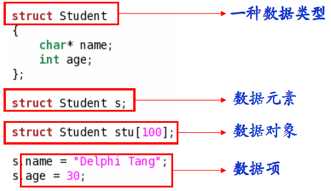
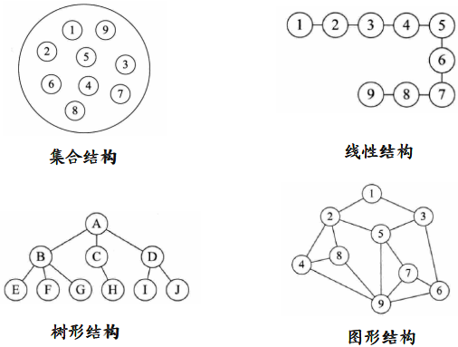
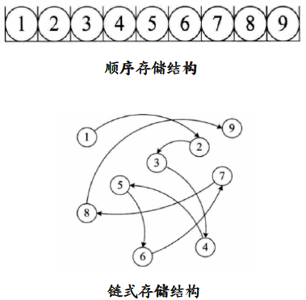
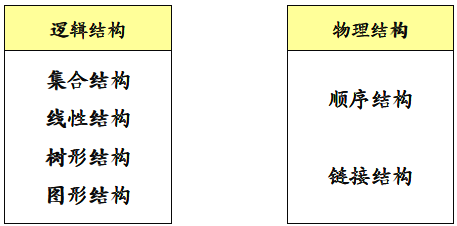

# 数据的艺术    

## 1、数据结构的起源    
- 计算机从解决数值计算问题到解决生活中的问题；    
- 现实生活中的问题涉及不同个体间的复杂联系；    
- 需要在计算机程序中描述生活中个体间的联系。    

**数据结构主要研究非数值计算程序问题中的操作对象以及它们之间的联系。**

## 2、关键概念
- 数据： 程序的操作对象，用于描述客观事物；
- 数据的特点：

	- 可以输入到计算机；
	- 可以被计算机程序处理。

    **数据是一个抽象的概念，将其进行分类后得到程序设计语言中的类型。如：int, float, char等等。**
- 数据元素： 组成数据的基本单位；    
	- 数据项： 一个数据元素由若干数据项组成；    
- 数据对象： 性质相同的数据元素的集合；    

- 数据元素之间不是独立的，存在特定的关系，这些关系即结构；
- 数据结构指数据对象中数据元素之间的关系。
	- 如：数组中各个元素之间存在固定的线性关系。

**编写一个“好”的程序之前，必须分析待处理问题中各个对象的特性，以及对象之间的关系。**
## 3、逻辑结构
- 集合结构
	- 数据元素之间没有特别的关系，仅同属相同集合
- 线性结构
	- 数据元素之间是一对一的关系
- 树形结构
	- 数据元素之间存在一对多的层次结构
- 图形结构
	- 数据元素之间是多对多的关系   

## 4、物理结构
- 物理结构
	- 逻辑结构在计算机中的存储形式
- 顺序存储结构
	- 将数据存储在地址连续的存储单元里
- 链式存储结构
	- 将数据存储在任意的存储单元里，通过保存地址的方式找到相关联的数据元素   

## 小结
- 数据结构是相互之间存在的一种或多种特定关系的数据元素的集合；
- 按照视点的不同，数据结构可以分为逻辑结构和物理结构。    
