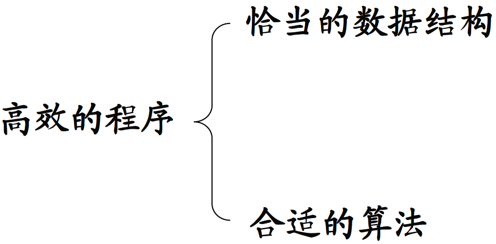

# 程序的灵魂-算法

## 1、数据结构与算法
- 数据结构只是静态的描述了数据元素之间的关系；
- 高效的程序需要在数据结构的基础上设计和选择算法。
<!--  -->

## 2、算法的定义
- 算法是特定问题求解步骤的描述；
- 在计算机中表现为指令的有序序列

**算法是独立存在的一种解决问题的方法和思想。**    
**对于算法而言，语言并不重要，重要的是思想。**    

## 3、算法的特性
- **输入**
  - 算法具有0个或多个输入
- **输出**
  - 算法至少有1个或多个输出
- **有穷性（与程序的区别的重要特征）**
  - 算法在有限的步骤之后会自动结束而不会无限循环
- **确定性**
  - 算法中的每一步都有确定的含义，不会出现二义性
- **可执行**
  - 算法的每一步都是可执行的

## 4、算法设计的准则
- **正确性**    
  - 算法对于合法数据能够得到满足要求的结果；    
  - 算法能够处理非法输入，并得到合理的结果；    
  - 算法对于边界数据和压力数据都能得到满足要求的结果（较难满足）    

**注意：**    
        正确性是算法最需满足的基本的准则，但是作为计算机程序，不可能无限制的满足这条准则。    
        
- **可读性**    
  - 算法要方便阅读，理解和交流    
- **健壮性**    
  - 算法不应该产生莫名其妙的结果    
- **高性价比**    
  - 利用最少的时间和资源得到满足要求的结果    

**注意：**     
    算法可读性是最容易被忽视的，然而，程序是写给人看的，而不是计算机。    

## 小结
- 算法是为了解决实际问题而设计的；
- 数据结构是算法需要处理问题的载体；
- 数据结构与算法相辅相成。

<!--  -->
