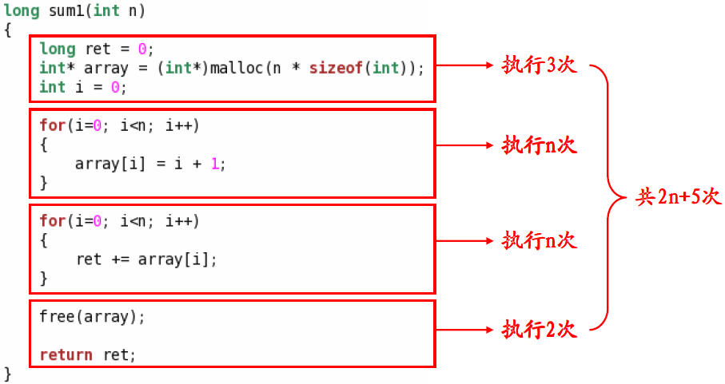
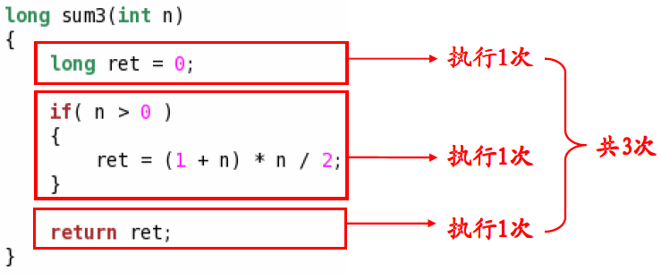
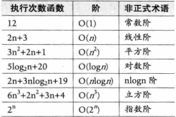
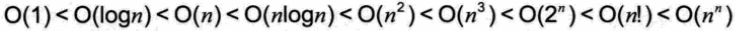

# 审判程序的灵魂
## 1、算法效率的度量
- **事后统计法**    
  - 比较不同算法对同一组输入数据的运行处理时间
  - 缺陷   
    - 为了获得不同算法的运行时间必须编写相应的程序；
    - 运行时间严重依赖硬件以及运行时的环境因素；
    - 算法的测试数据的选取相当困难。
     **事后统计法虽然直观，但是实施困难且缺陷多，一般不予考虑。**    
- **事前分析估算法**
  - 依据统计的方法对算法效率进行估算
  - 影响算法效率的主要因素
    - 算法采用的策略和方法
    - 问题的输入规模
    - 编译器所产生的代码
    - 计算机执行速度

- **算法效率的简单评估**
      
  
  **判断一个算法的效率时，往往只需要关注操作数量的最高次项，其他次要项和常数项可以忽略。**    

## 2、大O表示法    
- 算法效率严重依赖于操作(Operation)数量；    
- 在判断时首先关注操作数量的最高次项；    
- 操作数量的评估可以作为时间复杂度的估算。    
    O(5) = O(1)    
    O(2n + 1) = O(n)    
    O(n^2+ n + 1) = O(n^2)    
    O(2n^3 + 3n + 1) = O(2n^3) = O(n^3)    

## 3、常见时间复杂度类型    
  
  
- **最好与最坏**
  - 在没有特殊说明时，我们所分析的算法的时间复杂度都是指最坏时间复杂度。

## 4、算法的空间复杂度通过计算算法的存储空间实现
    S(n) = O(f(n))
其中，n为问题规模，f(n)为在问题规模为n时所占用存储空间的函数    
大O表示法同样适用于算法的空间复杂度，当算法执行时所需要的空间是常数时，空间复杂度为O(1)。

## 5、空间与时间的策略
- 多数情况下，算法执行时所用的时间更令人关注；
- 如果有必要，可以通过增加空间复杂度来降低时间复杂度；
- 同理，也可以通过增加时间复杂度来降低空间复杂度。    

**在实现算法时需要分析具体问题对执行时间和空间的要求。**
