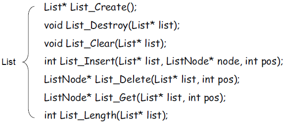

# 线性表的相关操作    

## 1、线性表的一些常用操作
- **创建**线性表   
- **销毁**线性表   
- **清空**线性表   
- 将元素**插入**线性表   
- 将元素从线性表中**删除**   
- 获取线性表中某个**位置**的元素   
- 获取线性表的**长度**   
   
## 2、 线性表操作的实现   
- 线性表在程序中表现为一种特殊的数据类型   
- 线性表的操作在程序中的表现为一组函数   

   

## 小结     
- 线性表在程序中表现为一种特殊的数据类型   
- 线性表的操作则表现为一组相关的函数   