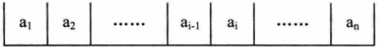
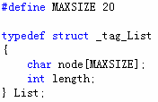
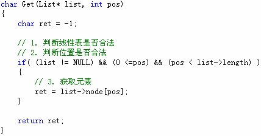
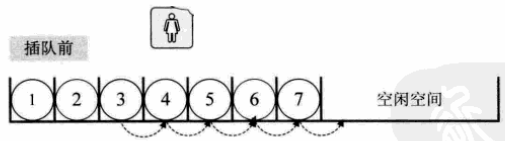
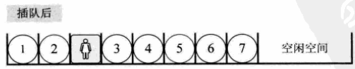
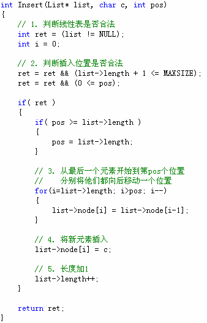
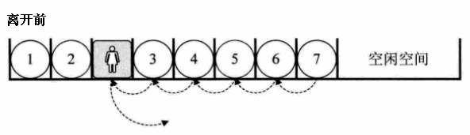
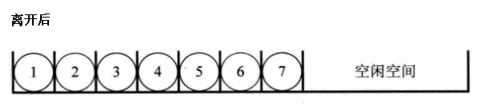
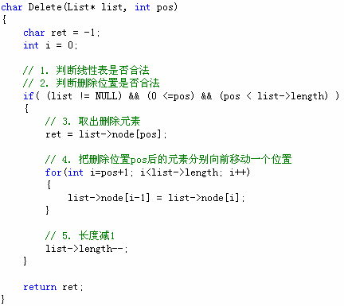

# 线性表的顺序存储结构  
## 1、 顺序存储定义
线性表的顺序存储结构，指的是用一段地址连续的存储单元依次存储线性表的数据元素。
    

## 2、顺序存储结构在C语言中可以用一维数组来实现顺序存储结构
- 存储空间的起始位置：数组名node    
- 线性表的最大容量：数组长度MAXSIZE    
- 线性表的当前长度：length    
    

## 3、 获取元素操作    
- 判断线性表是否合法    
- 判断位置是否合法    
- 直接通过数组下标的方式获取元素    
    

## 4、插入元素操作
    
    

## 5、插入元素算法    
- 判断线性表是否合法    
- 判断插入位置是否合法    
- 把最后一个元素到插入位置的元素后移一个位置    
- 将新元素插入    
- 线性表长度加1    
    

## 6、删除元素操作
    
    

## 7、删除元素算法   
- 判断线性表是否合法   
- 判断删除位置是否合法   
- 将元素取出   
- 将删除位置后的元素分别向前移动一个位置   
- 线性表长度减1   
    

## 8、创建可复用顺序线性表   

```c
#include <stdio.h>
#include <malloc.h>
#include "SeqList.h"
typedef unsigned int TSeqListNode;

typedef struct _tag_SeqList
{
    int capacity;
    int length;
    TSeqListNode* node;
} TSeqList;

SeqList* SeqList_Create(int capacity) // O(1)
{
    TSeqList* ret = NULL;
    
    if( capacity >= 0 )
    {
        //注意这里动态申请空间的方法，指针类型为TSeqList*，所以指针加1会指向sizeof(TSeqListNode) * capacity这块区域
        ret = (TSeqList*)malloc(sizeof(TSeqList) + sizeof(TSeqListNode) * capacity); 
    }
    
    if( ret != NULL )
    {
        ret->capacity = capacity;
        ret->length = 0;
        ret->node = (TSeqListNode*)(ret + 1); //注意这里动态申请空间的方法，只需要free一次就好，当然也可以将node单独申请空间
    }
    
    return ret;
}

void SeqList_Destroy(SeqList* list) // O(1)
{
    free(list);
}

void SeqList_Clear(SeqList* list) // O(1)
{
    TSeqList* sList = (TSeqList*)list;
    
    if( sList != NULL )
    {
        sList->length = 0;
    }
}

int SeqList_Length(SeqList* list) // O(1)
{
    TSeqList* sList = (TSeqList*)list;
    int ret = -1;
    
    if( sList != NULL )
    {
        ret = sList->length;
    }
    
    return ret;
}

int SeqList_Capacity(SeqList* list) // O(1)
{
    TSeqList* sList = (TSeqList*)list;
    int ret = -1;
    
    if( sList != NULL )
    {
        ret = sList->capacity;
    }
    
    return ret;
}

int SeqList_Insert(SeqList* list, SeqListNode* node, int pos) // O(n)
{
    TSeqList* sList = (TSeqList*)list;
    int ret = (sList != NULL);
    int i = 0;
    
    ret = ret && (sList->length + 1 <= sList->capacity);
    ret = ret && (0 <= pos);
    
    if( ret )
    {
        if( pos >= sList->length )
        {
            pos = sList->length;
        }
        
        for(i=sList->length; i>pos; i--)
        {
            sList->node[i] = sList->node[i-1];
        }
        
        sList->node[i] = (TSeqListNode)node;
        
        sList->length++;
    }
    
    return ret;
}

SeqListNode* SeqList_Get(SeqList* list, int pos) // O(1)
{
    TSeqList* sList = (TSeqList*)list;
    SeqListNode* ret = NULL;
    
    if( (sList != NULL) && (0 <= pos) && (pos < sList->length) )
    {
        ret = (SeqListNode*)(sList->node[pos]);
    }
    
    return ret;
}

SeqListNode* SeqList_Delete(SeqList* list, int pos) // O(n)
{
    TSeqList* sList = (TSeqList*)list;
    SeqListNode* ret = SeqList_Get(list, pos);
    int i = 0;
    
    if( ret != NULL )
    {
        for(i=pos+1; i<sList->length; i++)
        {
            sList->node[i-1] = sList->node[i];
        }
        
        sList->length--;
    }
    
    return ret;
}
```   

## 小结   
- **优点**：   
  - 无需为线性表中的逻辑关系增加额外的空间   
  - 可以快速的获取表中合法位置的元素   
- **缺点**：   
  - 插入和删除操作需要移动大量元素   
  - 当线性表长度变化较大时难以确定存储空间的容量   