# 线性表的链式存储结构   

## 1、链式存储定义   
为了表示每个数据元素与其直接后继元素之间的逻辑关系，每个元素除了存储本身的信息外，还需要存储指示其直接后继的信息。   

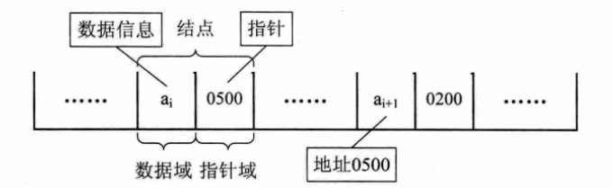   

## 2、链式存储逻辑结构    
n个结点链接成一个链式线性表的结构叫做链表，当每个结点中只包含一个指针域时，叫做单链表。   

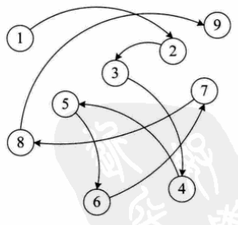   

## 3、单链表的基本概念   
- 表头结点   
  - 链表中的第一个结点，包含指向**第一个数据元素的指针**以及**链表自身的一些信息**(但是不是一个元素)。
- 数据结点
  - 链表中代表数据元素的结点，包含指向**下一个**数据元素的指针和数据元素的信息。
- 尾结点
  - 链表中的最后一个数据结点，其**下一元素指针为空**，表示无后继。

## 4、单链表示例
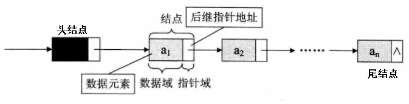   
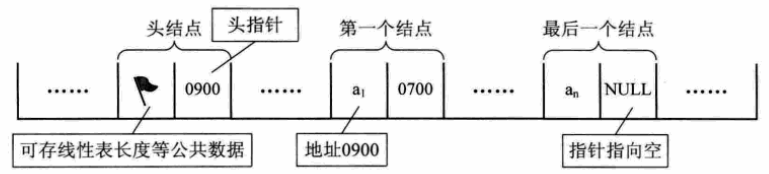   

## 5、在C语言中单链表的实现
- 在C语言中可以用**结构体**来定义链表中的**指针域**   
- 链表中的表头结点也可以用**结构体**实现   
  - **结点指针域定义**  
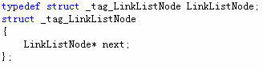   
  - **头结点定义**    
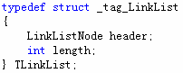      
  - **数据元素定义实例**     
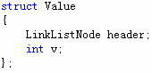      
- **获取第pos个元素操作**     
  - 判断线性表是否合法   
  - 判断位置是否合法   
  - 由表头开始通过next指针移动pos次后，当前元素的next指针即指向要获取的元素   
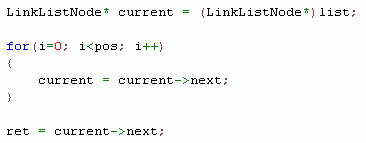   
- **插入元素操作**   
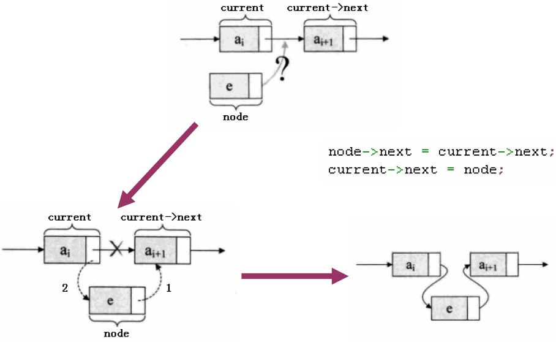   

- **插入元素到位置pos的算法**   
  - 判断线性表是否合法   
  - 判断插入位置是否合法   
  - **由表头开始通过next指针移动pos次后，当前元素的next指针即指向要插入的位置**   
  - 将新元素插入   
  - **线性表长度加1**   
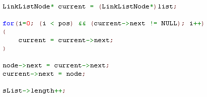   

- **删除第pos个元素的算法**
  - 判断线性表是否合法   
  - 判断插入位置是否合法   
  - 获取第pos个元素   
  - **将第pos个元素从链表中删除**   
  - **线性表长度减1**   
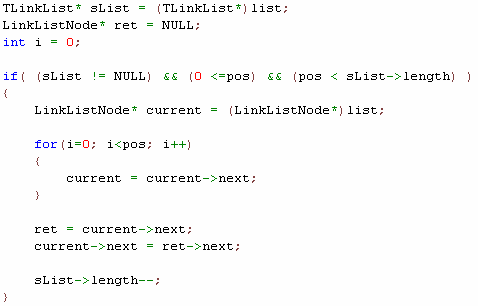   

## 6、创建可复用单链表

```c
typedef void LinkList;
typedef struct _tag_LinkListNode LinkListNode;
struct _tag_LinkListNode
{
    LinkListNode* next;
};


typedef struct _tag_LinkList
{
    LinkListNode header;
    int length;
} TLinkList;


LinkList* LinkList_Create() // O(1)
{
    TLinkList* ret = (TLinkList*)malloc(sizeof(TLinkList));
    
    if( ret != NULL )
    {
        ret->length = 0;
        ret->header.next = NULL;
    }
    
    return ret;
}


void LinkList_Destroy(LinkList* list) // O(1)
{
    free(list);
}


void LinkList_Clear(LinkList* list) // O(1)
{
    TLinkList* sList = (TLinkList*)list;
    
    if( sList != NULL )
    {
        sList->length = 0;
        sList->header.next = NULL;
    }
}


int LinkList_Length(LinkList* list) // O(1)
{
    TLinkList* sList = (TLinkList*)list;
    int ret = -1;
    
    if( sList != NULL )
    {
        ret = sList->length;
    }
    
    return ret;
}


int LinkList_Insert(LinkList* list, LinkListNode* node, int pos) // O(n)
{
    TLinkList* sList = (TLinkList*)list;
    int ret = (sList != NULL) && (pos >= 0) && (node != NULL);
    int i = 0;
    
    if( ret )
    {
        LinkListNode* current = (LinkListNode*)sList;
        
        for(i=0; (i<pos) && (current->next != NULL); i++)
        {
            current = current->next;
        }
        
        node->next = current->next;
        current->next = node;
        
        sList->length++;
    }
    
    return ret;
}


LinkListNode* LinkList_Get(LinkList* list, int pos) // O(n)
{
    TLinkList* sList = (TLinkList*)list;
    LinkListNode* ret = NULL;
    int i = 0;
    
    if( (sList != NULL) && (0 <= pos) && (pos < sList->length) )
    {
        LinkListNode* current = (LinkListNode*)sList;
        
        for(i=0; i<pos; i++)
        {
            current = current->next;
        }
        
        ret = current->next;
    }
    
    return ret;
}


LinkListNode* LinkList_Delete(LinkList* list, int pos) // O(n)
{
    TLinkList* sList = (TLinkList*)list;
    LinkListNode* ret = NULL;
    int i = 0;
    
    if( (sList != NULL) && (0 <= pos) && (pos < sList->length) )
    {
        LinkListNode* current = (LinkListNode*)sList;
        
        for(i=0; i<pos; i++)
        {
            current = current->next;
        }
        
        ret = current->next;
        current->next = ret->next;
        
        sList->length--;
    }
    
    return ret;
}
```

## 小结
- **优点**：
  - 无需一次性定制链表的容量
  - 插入和删除操作无需移动数据元素
- **缺点**：
  - 数据元素必须保存后继元素的位置信息
  - 获取指定数据的元素操作需要顺序访问之前的元素


