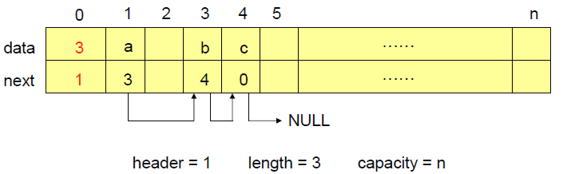
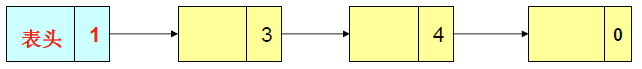
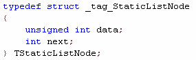
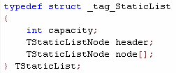
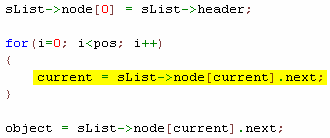
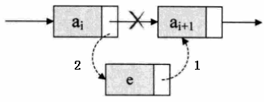
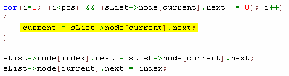
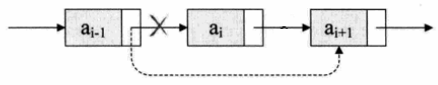
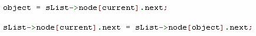

# 静态链表   

## 1、单链表的相对劣势   
- 单链表的实现严重依赖指针！   
- 数据元素中必须包含一个额外的指针域！   
- 没有指针的程序设计语言无法实现！   

## 2、静态链表的定义
- 顺序表数组中的元素由两个数据域组成：**data**和**next**；   
- **data**域用于存储**数据**；   
- **next**域用于存储下一个元素在数组中的**下标**。   

    
 
## 3、静态链表的逻辑结构   
    

静态链表是在顺序表的基础上利用数组实现的单链表！


## 4、静态链表相关定义
- **结点结构体定义**   
    

- **静态链表结构体定义**   
    

## 5、静态链表操作   
- **获取第pos个元素操作**   
  - 判断线性表是否合法   
  - 判断位置是否合法   
  - 由表头开始**通过next域**移动**pos**次后，当前元素的next域即要获取元素在数组中的下标   
    

- **插入元素到位置pos的算法**   
  - 判断线性表是否合法   
  - 判断插入位置是否合法   
  - **在数组中查找空闲位置index**   
  - 由表头开始通过next域移动pos次后，当前元素的next域为要插入的位置   
  - 将新元素插入   
  - 线性表长度加1   
  - 
    

    

- **删除第pos个元素的算法**   
  - 判断线性表是否合法   
  - 判断插入位置是否合法   
  - 获取第pos个元素   
  - 将第pos个元素从链表中删除   
  - 线性表长度减1   

    
    

## 6、创建可复用静态链表
```c
#define AVAILABLE -1


typedef void StaticList;
typedef void StaticListNode;


typedef struct _tag_StaticListNode
{
    unsigned int data;
    int next;
} TStaticListNode;


typedef struct _tag_StaticList
{
    int capacity;
    TStaticListNode header;
    TStaticListNode node[];
} TStaticList;


StaticList* StaticList_Create(int capacity) // O(n)
{
    TStaticList* ret = NULL;
    int i = 0;
    
    if( capacity >= 0 )
    {
        ret = (TStaticList*)malloc(sizeof(TStaticList) + sizeof(TStaticListNode) * (capacity + 1));
    }
    
    if( ret != NULL )
    {
        ret->capacity = capacity;
        ret->header.data = 0;
        ret->header.next = 0;
        
        for(i=1; i<=capacity; i++)
        {
            ret->node[i].next = AVAILABLE;
        }
    }
    
    return ret;
}


void StaticList_Destroy(StaticList* list) // O(1)
{
    free(list);
}


void StaticList_Clear(StaticList* list) // O(n)
{
    TStaticList* sList = (TStaticList*)list;
    int i = 0;
    
    if( sList != NULL )
    {
        sList->header.data = 0;
        sList->header.next = 0;
        
        for(i=1; i<=sList->capacity; i++)
        {
            sList->node[i].next = AVAILABLE;
        }
    }
}


int StaticList_Length(StaticList* list) // O(1)
{
    TStaticList* sList = (TStaticList*)list;
    int ret = -1;
    
    if( sList != NULL )
    {
        ret = sList->header.data;
    }
    
    return ret;
}


int StaticList_Capacity(StaticList* list) // O(1)
{
    TStaticList* sList = (TStaticList*)list;
    int ret = -1;
    
    if( sList != NULL )
    {
        ret = sList->capacity;
    }
    
    return ret;
}


int StaticList_Insert(StaticList* list, StaticListNode* node, int pos)  // O(n)
{
    TStaticList* sList = (TStaticList*)list;
    int ret = (sList != NULL);
    int current = 0;
    int index = 0;
    int i = 0;
    
    ret = ret && (sList->header.data + 1 <= sList->capacity);
    ret = ret && (pos >=0) && (node != NULL);
    
    if( ret )
    {
        for(i=1; i<=sList->capacity; i++)
        {
            if( sList->node[i].next == AVAILABLE )
            {
                index = i;
                break;
            }
        }
        
        sList->node[index].data = (unsigned int)node;
        
        sList->node[0] = sList->header;
        
        for(i=0; (i<pos) && (sList->node[current].next != 0); i++)
        {
            current = sList->node[current].next;
        }
        
        sList->node[index].next = sList->node[current].next;
        sList->node[current].next = index;
        
        sList->node[0].data++;
        
        sList->header = sList->node[0];
    }
    
    return ret;
}


StaticListNode* StaticList_Get(StaticList* list, int pos)  // O(n)
{
    TStaticList* sList = (TStaticList*)list;
    StaticListNode* ret = NULL;
    int current = 0;
    int object = 0;
    int i = 0;
    
    if( (sList != NULL) && (0 <= pos) && (pos < sList->header.data) )
    {
        sList->node[0] = sList->header;
        
        for(i=0; i<pos; i++)
        {
            current = sList->node[current].next; //静态链表的核心
        }
        
        object = sList->node[current].next;
        
        ret = (StaticListNode*)(sList->node[object].data);
    }
    
    return ret;
}


StaticListNode* StaticList_Delete(StaticList* list, int pos) // O(n)
{
    TStaticList* sList = (TStaticList*)list;
    StaticListNode* ret = NULL;
    int current = 0;
    int object = 0;
    int i = 0;
    
    if( (sList != NULL) && (0 <= pos) && (pos < sList->header.data) )
    {
        sList->node[0] = sList->header;
        
        for(i=0; i<pos; i++)
        {
            current = sList->node[current].next;
        }
        
        object = sList->node[current].next;
        
        sList->node[current].next = sList->node[object].next;
        
        sList->node[0].data--;
        
        sList->header = sList->node[0];
        
        sList->node[object].next = AVAILABLE;
        
        ret = (StaticListNode*)(sList->node[object].data);
    }
    
    return ret;
}
```

## 小结
- 静态链表其实是单链表的另一种实现方式
- 静态链表的实现“媒介”不是指针而是数组
- 静态链表主要用于不支持指针的程序设计语言中
- 静态链表的实现是一种内存管理的简易方法


