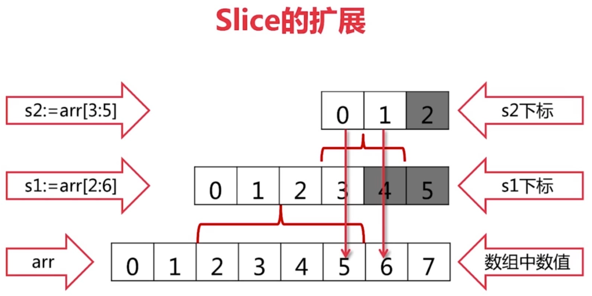

# 切片
切片是对原本array的一个view，所以通过切片更改数据也会对原array作出更改。
```go
arr := [...]int{0, 1, 2, 3, 4, 5, 6, 7}
s1 := arr[2:]
s2 := arr[:]
```

replace
```go
s := arr[2:6]
s = s[:3]
s = s[1:]
s = arr[:]
```


切片的扩展
```go
arr := […]int{0, 1, 2, 3, 4, 5, 6, 7}
s1 := arr[2:6]
s2 := s1[3:5]
```

- s1的值为[2 3 4 5]，s2的值为[5 6]；
- 切片可以向后扩展，不可以向前扩展；
- s[i]不可以超越len(s)，向后扩展不可以超越底层数组cap(s)


